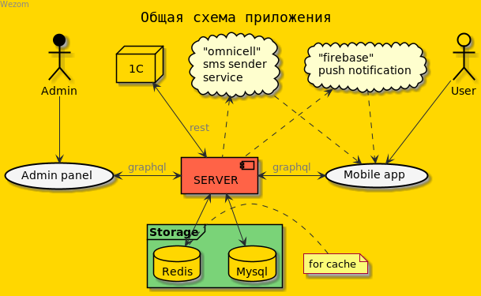
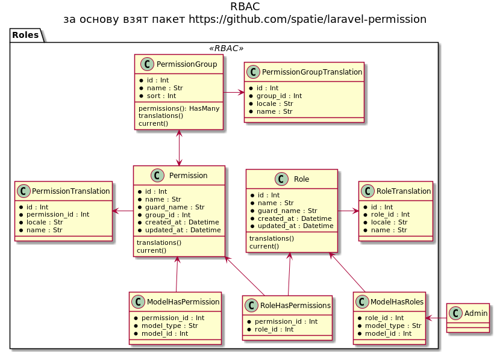

<div id="top"></div>
# Backend для проекта Армо моторс

<p align="center">
  
</p>

[](https://www.php.net/)
[](https://laravel.com/docs/8.x)
[](https://dev.mysql.com/doc/refman/8.0/en/)
[](https://lighthouse-php.com/)
[](https://redis.io/)


<!-- TABLE OF CONTENTS -->
<details>
  <summary>Table of Contents</summary>
  <ol>
    <li><a href="#about">О проекте</a></li>
    <li><a href="#lib">Используемые пакеты</a></li>
    <li>
        <a href="#deploy">Разворачивание проекта</a>
        <ul>
            <li><a href="#deploy-docker">Разворачивание проекта через docker</a></li>
            <li><a href="#env-file">Переменный окружения</a></li>
        </ul>
    </li>
    <li>
        <a href="#deploy">Модули</a>
        <ul>
            <li><a href="https://bitbucket.org/wezom/arma-motors/src/develop/docs/README_order.md">Order</a></li>
            <li><a href="https://bitbucket.org/wezom/arma-motors/src/develop/docs/README_agreement.md">Agreement</a></li>
        </ul>
    </li>
    <li><a href="#workers">Запущенные воркеры</a></li>
    <li><a href="#translations">Переводы</a></li>
    <li><a href="#roles">Ролевая система</a></li>
    <li><a href="#aa">Интеграция с AA</a></li>
    <li><a href="#dump">Dump</a></li>
  </ol>
</details>

<!-- ABOUT THE PROJECT -->
## О проекте
<div id="about"></div>
Проект является бэкендом для мобильного приложения (в дальнейшем МП) 
и административной панелью (в дальнейшем АП) компании <a href="https://www.arma-motors.ua/">Арма-моторс</a>  
(продажа, сервис обслуживания автомобилей),
общение осуществляется с помощью
GraphQL. Также осуществляется синхронизация (двухсторонняя) с системой учета 1С (в дальнейшем AA), 
через REST-API (<a href="https://app.swaggerhub.com/apis-docs/AuditSoft/MDMAPI/1.0.0">документация</a> 
описана с помощью swagger). Важная информация по проекту, 
диаграммы процессов и связей находятся в папке docs

<!-- Lib -->
## Используемые пакеты
<div id="lib"></div>
Lighthouse - для реализации GraphQL (
<a href="https://github.com/nuwave/lighthouse">repo</a>
<a href="https://lighthouse-php.com/4/getting-started/installation.html"> | docs</a>
)


<!-- Deployment -->
## Разворачивание проекта
<div id="deploy"></div>

1. Клонируем env файл

```sh
$ cp .env.example .env
```

2. Прописываем переменный окружения
   
3. Раскомментируем seed, после загрузки данных, имеет смысл их
   заново закомментировать, кроме сидов с разрешениями (подробнее здесь)
4. Выполнить последовательно команды
```sh
$ composer install
$ php artisan key:generate
$ php-fpm php artisan migrate
$ php-fpm php artisan db:seed
$ php-fpm php artisan passport:keys
$ php-fpm php artisan am:init # создает суперпользователя
$ php artisan am:translates-flow
$ sudo chmod 777 -R storage
```

5. Перенести секреты и id, для авторизации из бд (oauth_clients)
    в .env файл

<p align="right">(<a href="#top">back to top</a>)</p>

### Разворачивание проекта через docker
<div id="deploy-docker"></div>

проект и зависимости (бд, кеш, майлер) можно поднять через docker
выполняем шаги 1-3 
запускам инициализацию проекта (выполняется один раз)

```sh
$ make
```
выполнить шаг 5

в дальнейшем при разработке используем
команды

```sh
$ make up        # запускаем приложение
$ make down      # останавливаем приложение
$ make rebuild   # перестраиваем контейнеры
$ make info      # информация по приложению и полезные ссылки
$ make test      # запуск тестов
$ make test_init # инициализируем окр. для тестов, но не запускаем их
```
Больше команд можно увидеть в Makefile

<p align="right">(<a href="#top">back to top</a>)</p>

### Env файл
<div id="env-file"></div>

```sh
# Указываем ip для сети, в которой будут работать контейнеры
# актуально для dev режима, и если разработка идет через docker
DOCKER_BRIDGE=192.168.177.1
DOCKER_NETWORK=192.168.177.0/24
# Указываем данные сгенерированые паспортом для авторизации
# (таблица oauth_clients)
OAUTH_USERS_CLIENT_ID=
OAUTH_USERS_CLIENT_SECRET=
OAUTH_ADMINS_CLIENT_ID=
OAUTH_ADMINS_CLIENT_SECRET=
# Можно подключить бот для получение ошибок в телеграм
# для разработки
TELEGRAM_USE=false
TELEGRAM_ENV=local
TELEGRAM_TOKEN=
TELEGRAM_CHAT_ID=
# Данные по смс сервису, можно отключить тогда смс-код будет
# возвращаться в теле ответа, более детальный настройки
# в config/sms
ENABLE_SMS_SENDER=false
SMS_DRIVER=array
SMS_OMNICELL_URL=
SMS_OMNICELL_LOGIN=
SMS_OMNICELL_PASSWORD=
# Настройки Firebase для пуш уведомлений
ENABLE_FIREBASE=false
FIREBASE_SERVER_KEY=
FIREBASE_SENDER_ID=
FCM_SEND_URL=https://fcm.googleapis.com/fcm/send
# Генерировать случайны пароль при создании сотрудников, если отключен
# то сотрудники будут создаться с паролем "password"
RANDOM_PASSWORD=false
# Ссылка на админ панель
FRONTEND_URL=http://arma-front
# наши креда для AA 
AA_URL=http://192.168.177.1
AA_LOGIN=wezom-api
AA_PASSWORD=wezom-api
# креды AA для нашей системы, детальный настройки в config/aa
AA_TO_URL=
AA_TO_AUTH_TOKEN=
# вкл. логирование запросов/ответов с системой AA
ENABLE_AA_REQUEST_LOGGING=true
```

<p align="right">(<a href="#top">back to top</a>)</p>

<!-- Worker -->
## Worker
<div id="workers"></div>
Фоновые воркеры
<dl>
  <dt>am:worker:remove-sms-token</dt>
  <dd>
    Удаляет старые sms токены, которые небыли использованы,
    запускается один раз в полночь
  </dd>
  <dt>am:worker:remove-email-token</dt>
  <dd>
    Удаляет старые email токены, которые небыли использованы,
    запускается один раз в полночь
  </dd>
  <dt>am:worker:remove-aa-responses</dt>
  <dd>
    Удаляет старые записи запросов по синхронизации аа,
    который используется для логирования ответов от AA,
    в конфиге aa.old_days - указываем сколько дней храним записи
    запускается один раз в полночь
  </dd>
  <dt>am:worker:remove-aa-free-slots</dt>
  <dd>
    Удаляет старые слоты времени аа (используются для просчета свободного времени на запись заявки), 
    который уже не актуальны,
    запускается один раз в "23:55"
  </dd>
  <dt>am:worker:remind-order</dt>
  <dd>
    Отправляет пуш уведомление для напоминания о назначеной заявки,
    запускается каждые пять минут в течении дня
  </dd>
</dl>

<!-- Translations -->
## Переводы
<div id="translations"></div>
Системный переводы заносятся в resource/lang/en
команда ниже перегоняет переводы из файлов в бд (для двух языков - ru, ua)
а затем из бд в файлы ru и ua, записываются в бд только те переводы которых нет.
Это реализовано для того что бы дать возможность редактировать из админ-панели

```
php artisan am:translates-flow
```

<p align="right">(<a href="#top">back to top</a>)</p>

<!-- Roles -->
## Ролевая система
<div id="roles"></div>

роли есть только у сотрудников, в системе есть одна предустановленная роль (super-admin) и 
пользователь с этой ролью, данной роли не присваиваются разрешения 
(у нее есть все разрешения по умолчанию). Другие роли создаются в админке, им 
присваиваются разрешения, пользователям присваивается роль, разрешения не создаются, 
они предустановленны в системе.

Разрешения добавляются через файл database/seeders/_permissions.csv в таком формате

```
role.get,Получить роль,Отримати роль,Роли,Pолі,1
```

1 эл. - алиас разрешения
2,3 эл. - название роли (рус/укр)
4,5 эл. - название группы разрешений
6 эл. - сортировка группы


##### Схема связей ролей и разрешений


<p align="right">(<a href="#top">back to top</a>)</p>

<!-- АА -->
## Интеграция с АА
<div id="aa"></div>

- логи ответов и запросов пишутся в файл storage/logs/aa-request.log
    (в env-файле нужно включить запись)
- API документация АА - https://app.swaggerhub.com/apis-docs/AuditSoft/MDMAPI/1.0.0
- API документация - {domain}/api/v1/documentation


<p align="right">(<a href="#top">back to top</a>)</p>

<!-- Dump -->
## Dump
<div id="dump"></div>

Если нужно стянуть дамп базы данных с тестового или прода, и накатить
на локальную бд, можно воспользоваться bash скриптом, скрипт расчитан 
что накатывание дампа происходит в бд которое крутиться в докер-контейнере, 
в противном случаем через скрипт можно стянуть только дамп, а потом самостоятельно накатить
на вашу бд

```sh
$ ./dump.sh     # стянет импорт с тестового и накатит локально
$ ./dump.sh -p  # стянет импорт с прода и накатит локально
$ ./dump.sh -i  # стянет импорт с тестового
```

<p align="right">(<a href="#top">back to top</a>)</p>
