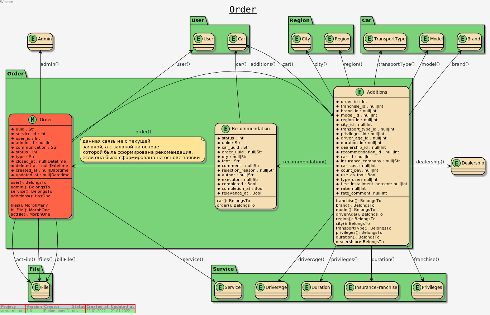
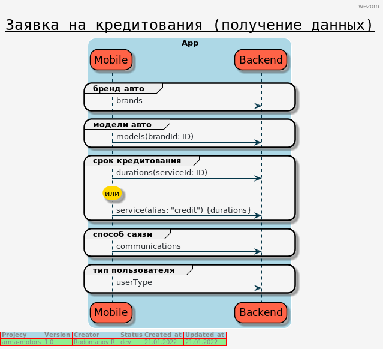
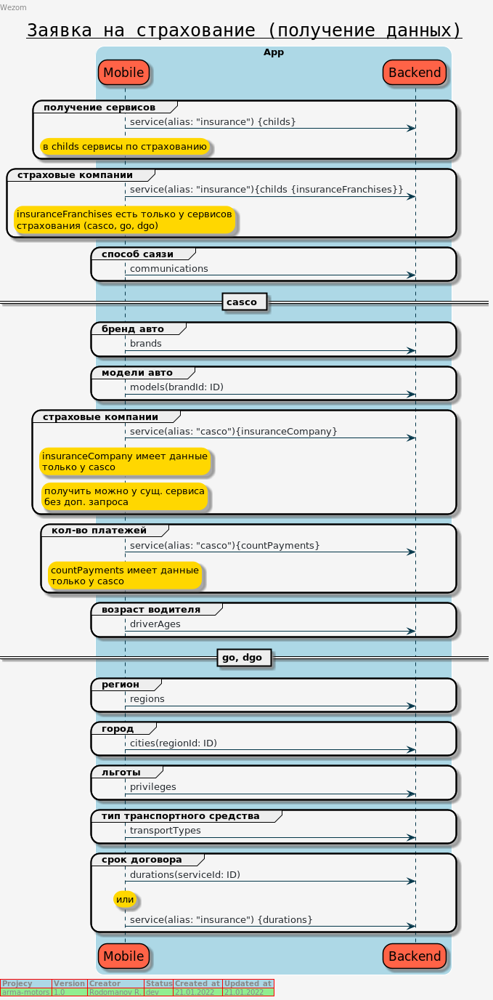
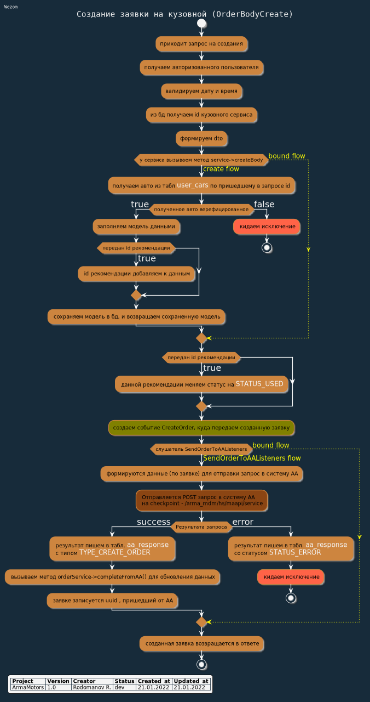
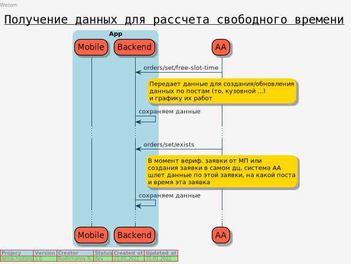
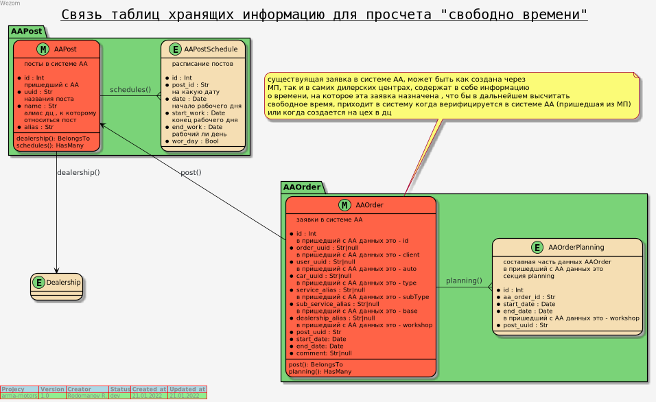

## Модуль заявки (order)

(<a href="https://bitbucket.org/wezom/arma-motors/src/develop/#top">back to main</a>)

##### Схема связей

    При создании заявки, в таб. Order все поля обязательны (кроме admin, он устанавливается в админке),
    в таб. additions - записываются доп. данные по заявки, для каждого типа заявки
    (кузовной, страховка, то ...) они разные

<!-- TABLE OF CONTENTS -->
<ol>
    <li><a href="#creat-order-flow">Получение данных при создании заявки для МП</a></li>
    <li><a href="#creat-order-body">Действия при создании заявки на кузовной</a></li>
    <li><a href="#free-time">Свободные слоты времени</a></li>
</ol>

##### Create flow

(<a href="#order-top">back to top</a>)

#### Flow по созданию заявки на кузовной ремонт

(<a href="#order-top">back to top</a>)

#### Свободные слоты времени

Процесс получения данных и расчет свободного времени (в разработке)

Связи данных

(<a href="#order-top">back to top</a>)

