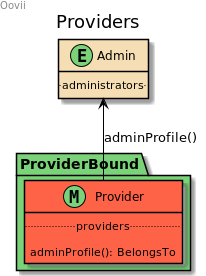

## Модуль поставщика (provider)

Модуль отвечает за работу с поставщиками (в дальнейшем P),
P - либо регистрироваться в админку самостоятельно или его создает админ,
сохраняется в отдельную табл. (providers). После создания/регистрации не имеет доступ
в админку пока не будет промодерирован админом, после модерации, создается профиль
админа с ролью Provider после чего может авторизоваться в админке

(<a href="https://bitbucket.org/wezom/oovii-backend/src/develop/#top">return to main</a>)

### Схема связей

