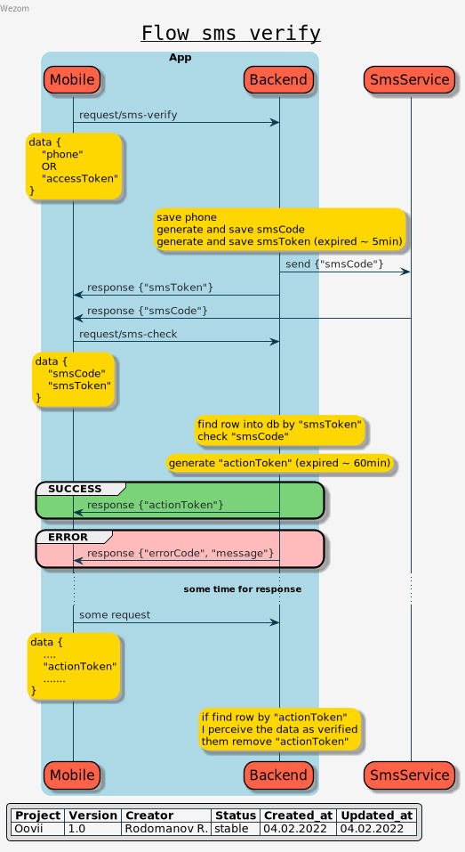
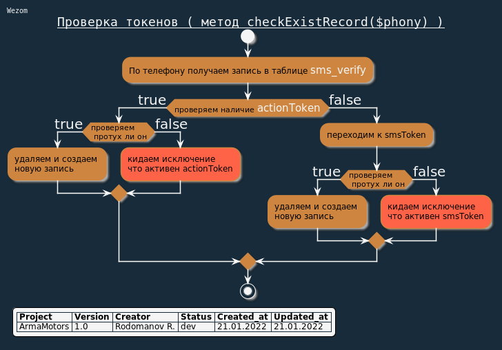

## Модуль SMS - верификации

(<a href="https://bitbucket.org/wezom/oovii-backend/src/develop/#top">return to main</a>)

Модуль для верификации телефона через sms-code, не привязывается к пользователю
или к какой-то другой сущности, может быть использован в любых местах где нужно
быть уверенным что телефон (или иные данные) верифицирован

### Визуализация процессов

