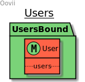

## Модуль Пользователей (users)


<div id="users-about"></div>
Модуль отвечает за создание и работу с пользователем (в дальнейшем user),
user регистрируется через мобильного приложения (в дальнейшем МП)

<p align="right">(<a href="https://bitbucket.org/wezom/oovii-backend/src/develop/#top">return to main</a>)</p>

### Схема связей



[comment]: <> (## Installation)

[comment]: <> (#### Use console)

[comment]: <> (```bash)

[comment]: <> (composer require wezom-cms/users)

[comment]: <> (```)

[comment]: <> (#### Or edit composer.json)

[comment]: <> (```json)

[comment]: <> ("require": {)

[comment]: <> (    ...)

[comment]: <> (    "wezom-cms/users": "^8.1")

[comment]: <> (})

[comment]: <> (```)

[comment]: <> (#### Install dependencies:)

[comment]: <> (```bash)

[comment]: <> (composer update)

[comment]: <> (```)

[comment]: <> (#### Package discover)

[comment]: <> (```bash)

[comment]: <> (php artisan package:discover)

[comment]: <> (```)

[comment]: <> (#### Run migrations)

[comment]: <> (```bash)

[comment]: <> (php artisan migrate)

[comment]: <> (```)

[comment]: <> (## Publish)

[comment]: <> (#### Views)

[comment]: <> (```bash)

[comment]: <> (php artisan vendor:publish --provider="WezomCms\Users\UsersServiceProvider" --tag="views")

[comment]: <> (```)

[comment]: <> (#### Config)

[comment]: <> (```bash)

[comment]: <> (php artisan vendor:publish --provider="WezomCms\Users\UsersServiceProvider" --tag="config")

[comment]: <> (```)

[comment]: <> (#### Lang)

[comment]: <> (```bash)

[comment]: <> (php artisan vendor:publish --provider="WezomCms\Users\UsersServiceProvider" --tag="lang")

[comment]: <> (```)

[comment]: <> (#### Migrations)

[comment]: <> (```bash)

[comment]: <> (php artisan vendor:publish --provider="WezomCms\Users\UsersServiceProvider" --tag="migrations")

[comment]: <> (```)
